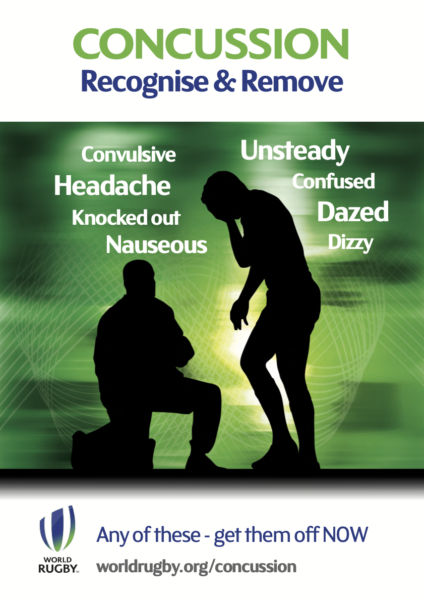

Current as of 2024 September 24

## Recognize and Remove is the standard

This is to reiterate, or educate, what the community game is to use as a policy related to player safety with regards to concussion.

World Rugby's default policy is <a href='https://www.world.rugby/the-game/player-welfare/medical/concussion/recognise-and-remove' target='_blank'>Recognise and Remove</a>. If a match official or a medical officer, which is the appointed on-site medical presence, has recognized a player "might have a suspected concussion" that player is to be removed and may take no further part in match day events.

The full process is documented on World Rugby’s site and linked above. It contains more authoritative details on that specific process. World Rugby’s advert for this process is attached further down.

The “Recognise and Remove” process is codified in <a href='https://www.world.rugby/the-game/laws/law/3' target='_blank'>Law at 3.24</a>, reprinted here

> PERMANENT REPLACEMENT - RECOGNISE AND REMOVE 24. 
> If, at any point during a match, a player is concussed or has suspected concussion, that player must be immediately and permanently removed from the playing area. This process is known as "Recognise and Remove".

In our game at the community level, there is no Head Injury Assessment (HIA) process. This is also codified in Law at 3.27, reprinted in part here

> TEMPORARY REPLACEMENT - HEAD INJURY ASSESSMENT (HIA) 27. In matches which have been approved in advance by World Rugby for use of the HIA process...

Additionally, for conditions that are not related to concussion, a player cannot be temporarily replaced in order for a medical assessment to be done and allowed to return.

A player may be assessed without being replaced, but a team must be able to form a competitive scrum when required.

## More details on Law 3

There are three kinds of replacements allowed

- Permanent: Permanent Replacements are injured players and CANNOT return under any circumstance.
- Temporary: Temporary Replacements are used in our levels only as a consequence of blood.
  - The replaced player has 15 minutes (real time, not game time) to return to the field.
  - If the replaced player has not returned within the 15 minutes, the Temporary Replacement becomes a Permanent Replacement and the original replaced player cannot return under any circumstance.
- Tactical: A player who has been tactically replaced is able to return to the field for
  - A front-row player and their return will allow contested scrums to continue
  - A player with a blood injury
  - A player who has been injured as a result of foul play (note: the injured player becomes a Permanent Replacement and cannot return to the field)

This becomes complicated quickly as it affects front row players. Applicable Law is 3.13, 3.15, 3.16, and 3.12.

The following indicates whether a team who cannot field a suitably trained front row (3.12) (1) loses any additional players and (2) the total number of players on the field for that team in that scenario.

<table>
  <thead>
    <th colspan="2" style="border-bottom-style: hidden;"> </th>
    <th colspan="5" style="background-color: bisque;">SECOND EVENT</th>
  </thead>
  <tbody>
    <tr>
      <td rowspan="1"> </td>
      <td rowspan="1" style="border-left-style: hidden;"> </td>
      <td rowspan="1">Foul play injury</td>
      <td rowspan="1">Blood injury</td>
      <td rowspan="1">Contact injury</td>
      <td rowspan="1">Yellow card</td>
      <td rowspan="1">Red card</td>
    </tr>
    <tr>
      <td rowspan="6" style="background-color: lightblue;text-align: center;"><strong>FIRST EVENT</strong></td>
      <td>Foul play injury</td>
      <td>NO</td>
      <td>NO</td>
      <td>NO</td>
      <td>YES (13)</td>
      <td>YES (13)</td>
    </tr>
    <tr>
      <td>Blood injury</td>
      <td>NO</td>
      <td>NO</td>
      <td>NO</td>
      <td>YES (13)</td>
      <td>YES (13)</td>
    </tr>
    <tr>
      <td>Head injury</td>
      <td>NO</td>
      <td>NO</td>
      <td>NO</td>
      <td>YES (13)</td>
      <td>YES (13)</td>
    </tr>
    <tr>
      <td>Contact injury</td>
      <td>NO</td>
      <td>NO</td>
      <td>YES (14)</td>
      <td>YES (13)</td>
      <td>YES (13)</td>
    </tr>
    <tr>
      <td>Yellow card</td>
      <td>NO</td>
      <td>NO</td>
      <td>YES (13)</td>
      <td>YES (12)</td>
      <td>YES (12)</td>
    </tr>
    <tr>
      <td>Red card</td>
      <td>NO</td>
      <td>NO</td>
      <td>YES (13)</td>
      <td>YES (12)</td>
      <td>YES (12)</td>
    </tr>
  </tbody>
</table>

### Scenario 1

Blue replaces their TH at minute 23 for injury, and the replacement TH is injured. If there are no players who can safely play TH as a part of their nominated FR rostered players, then scrums are to be uncontested.
This would be a First Event of “Contact injury” and a Second Event of “Contact injury”. Blue must use their final FR sub, who must pack in the uncontested scrum in the FR, and nominate a player to be replaced by the final FR sub in addition to the injured player (who cannot be replaced [3.17]). Blue continues the match with 14, packing 8 in the scrum.

### Scenario 2

In another case, White #1 is Yellow Carded and temporarily suspended. At the next scrum in the match, White #17 replaces White #11 (who was nominated to drop to accommodate contested scrums). White restarts play with 14 players. After that scrum, White #17 is Red Carded and sent off and White continues with 13 players. At the next scrum, White 18 (who can play both TH and LH) replaces White #6 (who was nominated to drop to accommodate contested scrums). Since contested scrums can continue, White does not lose another player and continues with 13. If White was _not_ able to replace #17 and scrums had to be uncontested, then White would play with 12 because _foul play was the reason scrums needed to be uncontested_.
