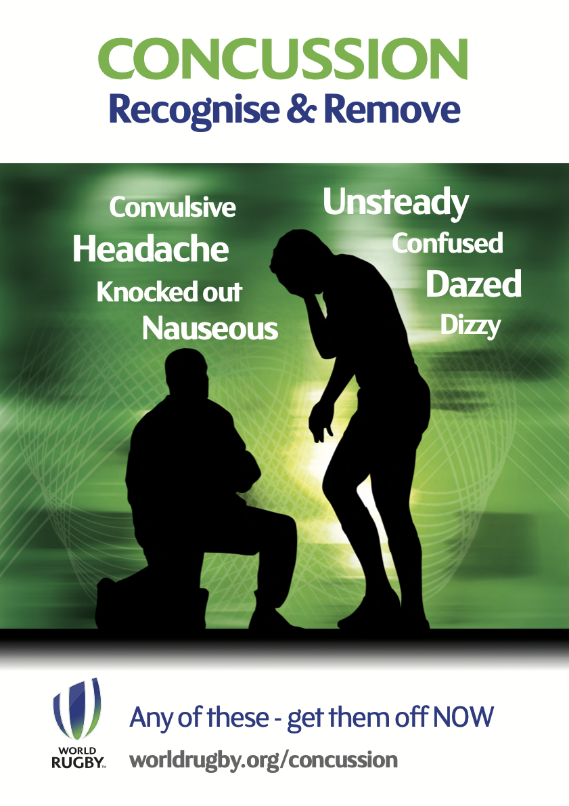

Current as of 2024 September 24

## Recognize and Remove is the standard

This is to reiterate, or educate, what the community game is to use as a policy related to player safety with regards to concussion.

World Rugby's default policy is <a href='https://www.world.rugby/the-game/player-welfare/medical/concussion/recognise-and-remove' target='_blank'>Recognise and Remove</a>. If a match official or a medical officer, which is the appointed on-site medical presence, has recognized a player "might have a suspected concussion" that player is to be removed and may take no further part in match day events.

The full process is documented on World Rugby’s site and linked above. It contains more authoritative details on that specific process. World Rugby’s advert for this process is attached further down.

The “Recognise and Remove” process is codified in <a href='https://www.world.rugby/the-game/laws/law/3' target='_blank'>Law at 3.24</a>, reprinted here

> PERMANENT REPLACEMENT - RECOGNISE AND REMOVE 24. 
> If, at any point during a match, a player is concussed or has suspected concussion, that player must be immediately and permanently removed from the playing area. This process is known as "Recognise and Remove".

In our game at the community level, there is no Head Injury Assessment (HIA) process. This is also codified in Law at 3.27, reprinted in part here

> TEMPORARY REPLACEMENT - HEAD INJURY ASSESSMENT (HIA) 27. In matches which have been approved in advance by World Rugby for use of the HIA process...

Additionally, for conditions that are not related to concussion, a player cannot be temporarily replaced in order for a medical assessment to be done and allowed to return.

A player may be assessed without being replaced, but a team must be able to form a competitive scrum when required.

## More details on Law 3

:::note
Updated Aug 2026 to remove processes for teams not fielding a competitive scrum due to replacements in various scenarios that no longer apply to the community game per the 2026-27 USA Rugby Game Management Guidelines
:::

There are three kinds of replacements allowed

- Permanent: Permanent Replacements are injured players and CANNOT return under any circumstance.
- Temporary: Temporary Replacements are used in our levels only as a consequence of blood.
  - The replaced player has 15 minutes (real time, not game time) to return to the field.
  - If the replaced player has not returned within the 15 minutes, the Temporary Replacement becomes a Permanent Replacement and the original replaced player cannot return under any circumstance.
- Tactical: A player who has been tactically replaced is able to return to the field for
  - A front-row player and their return will allow contested scrums to continue
  - A player with a blood injury
  - A player who has been injured as a result of foul play (note: the injured player becomes a Permanent Replacement and cannot return to the field)
