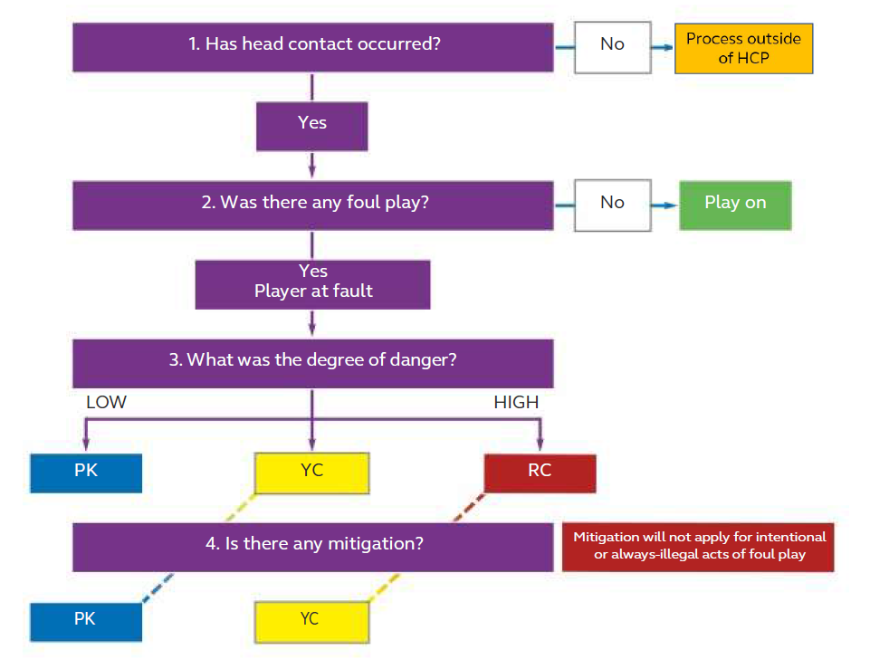

# History

In May 2019, World Rugby released the first iteration of the Head Contact Process framework. It was an attempt to provide consistency in decision making with regards to foul play with head contact. The aim was to provide an algorithm to produce outcomes that were consistent and explainable. There may be disagreements on decisions made during the process, but based on the referee's decisions and judgments, the outcomes were consistent.

# Latest iteration

The <a href="https://www.world.rugby/the-game/laws/guidelines/26" target="_blank">most recent edition</a> was released in March 2023. More details can be found <a href="https://resources.world.rugby/worldrugby/document/2023/03/22/932e873f-afc4-4fcc-a769-bae0ac660689/2303_Head_Contact_Process_EN.pdf" target="_blank">here</a>.

