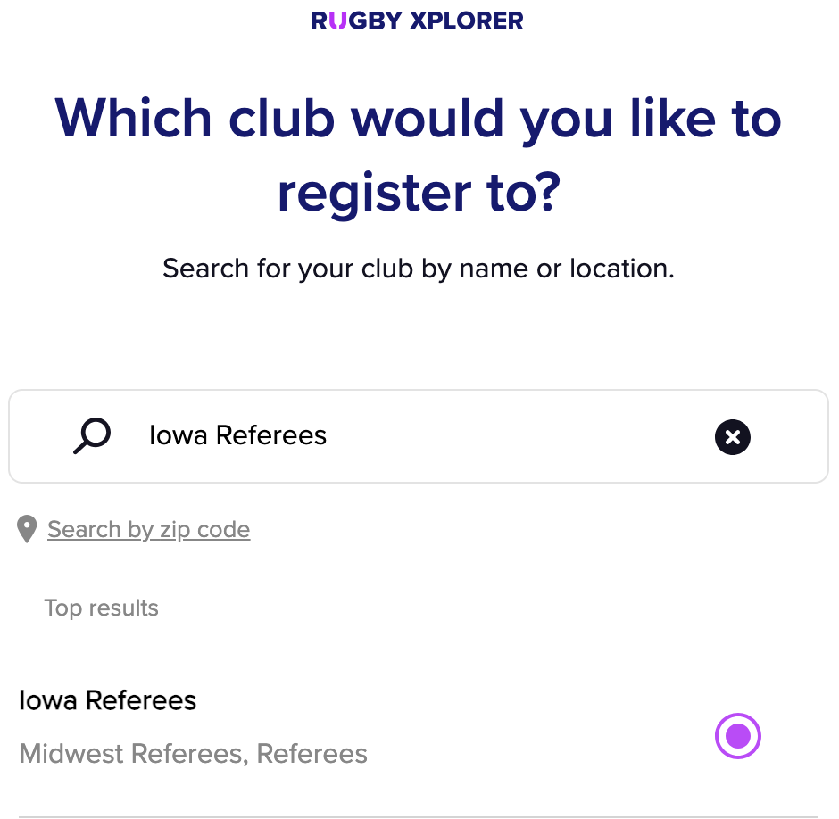

Each competitve cycle (typically September through August), you'll need to register as a Referee before you can get into the center.

## Register with USA Rugby

In order to referee rugby in Iowa, you will need to register with USA Rugby as a referee.

USA Rugby registration is done through <a href='https://myaccount.rugbyxplorer.com.au' target='_blank'>Rugby Xplorer</a>. For help on using Rugby Xplorer, see <a href='https://usa.rugby/members' target='_blank'>USA Rugby's guides</a>.

When selecting the club you'll register to, make sure you use "Iowa Referees" as your entity! You can dual register as a player with your normal club, but please do referee registration with Iowa Referees.

You may also have modules (like SafeSport, Background Check, etc) to complete to be Compliant when you register.

## Register with NCR (optional)

You can <a href='https://www.ncr.rugby/referee-registration' target='_blank'>register with NCR as a referee</a> for free. This is not required to referee matches involving NCR affiliated clubs.

## Register on RefUp

Our senior and collegiate referee work is managed on RefUp. <a href='https://refup.io/signup/society-of-iowa-rugby-referees' target='_blank'>Register with RefUp</a> to work collegiate and senior side matches. Registrations will need to be approved. For assistance with RefUp, see their Help docs first, then feel free to ask.
